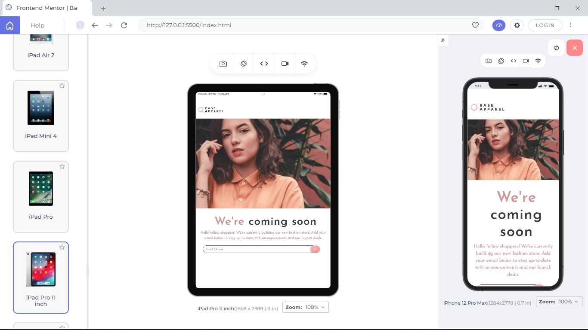
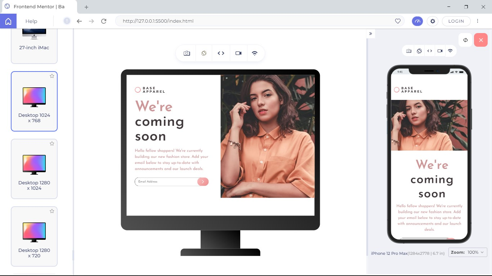
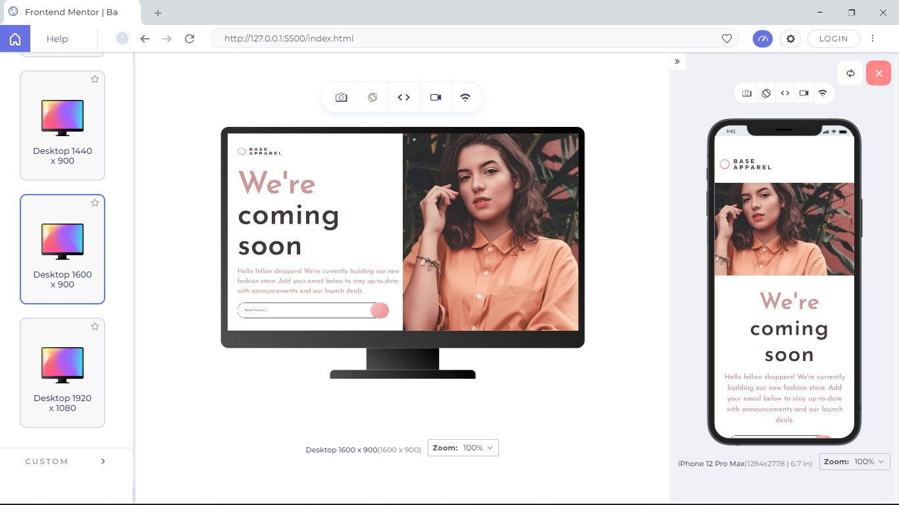

# Frontend Mentor - Base Apparel coming soon page solution

This is a solution to the [Base Apparel coming soon page challenge on Frontend Mentor](https://www.frontendmentor.io/challenges/base-apparel-coming-soon-page-5d46b47f8db8a7063f9331a0). 

## Table of contents

- [Overview](#overview)
  - [The challenge](#the-challenge)
  - [Screenshot](#screenshot)
  - [Links](#links)
- [My process](#my-process)
  - [Built with](#built-with)
  - [What I learned](#what-i-learned)
  - [Continued development](#continued-development)
  - [Useful resources](#useful-resources)
- [Author](#author)
- [Acknowledgments](#acknowledgments)

## Overview

### The challenge

Users should be able to:

- View the optimal layout for the site depending on their device's screen size
- See hover states for all interactive elements on the page
- Receive an error message when the `form` is submitted if:
  - The `input` field is empty
  - The email address is not formatted correctly

### Screenshot

### Links

- Solution URL: (https://github.com/Praixx/base-apparel-coming-soon-master)
- Live Site URL: (https://imaginative-hotteok-2e24ad.netlify.app/)

## My process

### Built with

- Semantic HTML5 markup
- CSS custom properties
- Flexbox
- CSS Grid
- Mobile-first workflow
- Javascript

### What I learned

i worked with form validation using Javascript. i was able to learn the basis of form validation and 
also apply it to this project.

i also worked the javascript setTimeout property and i was proud i was able to reset the field after a particular time limit

setTimeout(function(){

  if(result == "failure"){
    document.getElementById(emailField.id).focus();
    document.getElementById("email").style.border ="1px solid var(--Dark-Grayish-Red)";
    document.getElementById("email").value = "";
    document.getElementById("error-message").style.display = "none";
    document.querySelector(".error-icon").style.display = "none";             
  }
}, 3000)

### Continued development

### Useful resources

## Author

- Github - [Olaoye Praise](https://github.com/Praixx)
- Email - [Olaoye Praise](praix1y@gmail.com)
- Twitter - [@Praixx_](https://www.twitter.com/Praixx_)

## Acknowledgments

